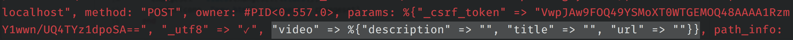

# Phoenix Workshop

## Install Phoenix

`mix archive.install https://github.com/phoenixframework/archives/raw/master/phoenix_new.ez`

## Check Phoenix version

`mix phoenix.new -v`

## Create Phoenix Project

First, we need to create a new phoenix project. To do that, just run:

`mix phoenix.new ex_video`

It will creating bunch of stuff and will installing some nodejs packages since Phoenix using brunch.io. You can also get rid of brunch if you want to. Just remove `brunch-config.js` file and do `npm install webpack` for example. It’s that easy.

## Run Our First Phoenix App

After the installation complete, let’s try it. But first, let’s create a database by running this command

`mix ecto.create`

It will compile our app the will create database, if our database setting is correct.

```text
…
The database for ExVideo.Repo has been created.
```

If not, the database setting is on `config/dev.exs` script file. You can change the database setting there. Oh yeah, Ecto, the database layer by default using PostgreSQL. You can change that when creating the app by adding `—database` option. `—database sqlite` or `mysql` for example.

Ok, after we create the database, let’s run our app.

`mix phoenix.server`

`[info] Running ExVideo.Endpoint with Cowboy using http on port 4000`

then open our browser, viola. Our app up and running!

The interesting part is if we run some benchmark on this barebone phoenix app like this:

[open CPU activity monitor first]

`wrk -t4 -c100 -d30S --timeout 2000 "http://127.0.0.1:4000"`

And we monitor the CPU, all 4 of my core getting exposed! How cool is that? No other frameworks that I worked before doing this kind of optimization by default. In other word, we have to do nothing to optimize this framework.

Ok, let’s see one more cool tools provided by Erlang, called observer. But first we need to shut down the phoenix server and run within iex. IEx is Elixir REPL and we can run mix task inside it so we can do debug thing there.

`iex -S mix phoenix.server`

Now we can run the observer, tools from Erlang:
`iex(1)> :observer.start()`

With this tools you can monitor the memory usage, applications, processes and others. If let say you get some memory leak, we can use this tools to figure out where the leak is. (Playing around with Processes tab for a while).

What interesting is in Application tab. Let say we have one bad request that takes too long, query too much then the database pool died. Then what happen? When one process died, it will replaced by new one, thanks to Supervisor and OTP. But this OTP topic for another meetup. You can sponsor me again next month to talk about this :) Let’s emulate this scenario. It’s dead, then comes up live again with new processes, as you can see the new processes id. Sure, the client will need to reconnect with the database pool. But the system is still up and our system can normally run again in no time.

Shall we continue, or you want me to kill this Terminator processes? :)


## Video Feature

Let's start build this app.

### Index Page
We’re ready to create our first module or feature which is Video. To do that we have two options: using generator or manually. The easy way or the hard way. 

And because we’re learning, let’s do the hard way first. Let’s create the routes first. Open up `web/router.ex` and add this line.

```elixir
  scope “/“, ExVideo do
    pipe_through :browser # Use the default browser stack

    get “/videos”, VideoController, :index
 # add this line
    get “/“, PageController, :index
  end
```

We just add one routes for our video index page. And now, if we open `http://localhost:4000/videos` of course it will complain, because we haven’t create the controller yet. Let’s do it now. Create a new controller in `web/controller/video_controller.ex`

```elixir
defmodule ExVideo.VideoController do
  use ExVideo.Web, :controller

  def index(conn, _params) do
    render conn, “index.html”
  end

end
```

If you wonder what is `ExVideo.Web, :controller` let’s see the file. It’s on `web/web.ex`. It’s like helpers for each phoenix components: controller, view, model. If in controller, we’re importing Ecto and router so we don’t have to do it everytime we create a new controller. For model and view as well. So if you want to import package in every controller, or view or model, just add to this file.

Ok, wanna refresh the browser? We got compain again: It says no VideoView. Let’s create one now. Create a new file in `web/views/video_view.ex` and add the following code:

```elixir
defmodule ExVideo.VideoView do
  use ExVideo.Web, :view

end
```

Refresh the browser and see what happen. Yay! We got another complain. There was no `index.html` in video template. So we just have to create one. First we have to create `templates/video` directory and create the `index.html.eex` file inside that. and finally it stop complaining :)

### New Video Page

Now we want to add a new video link. We add `new` function in the video controller. But before that, let’s add the routes we need in order to add new video.

```elixir
    get “/videos/new”, VideoController, :new
    post “/videos/new”, VideoController, :create

```

We did add two routes, one for form display, the other one for submitting a form. Pretty straight forward, right?! Now, let’s add new action in the controller.


```elixir
  def new(conn, _params) do
    render(conn, “new.html”)
  end
```

And also we need the `new.html` template. Ok, now we need form, and phoenix provides us with form helper that coupled with database’s changeset. So in order to get chageset we need model. Let’s create video model in `web/models/video.ex`.

```elixir
defmodule ExVideo.Video do
  use ExVideo.Web, :model

  schema “videos” do
    field :url, :string
    field :title, :string
    field :description, :string

    timestamps
  end

  @required_fields ~w(url title)
  @optional_field ~w(description)

  def changeset(model, params \\ :empty) do
    model
    |> cast(params, @required_fields, @optional_field)
  end
end
```

What is `~w`?


We also need to create the table in the database. To do that we use migration like this:

`mix ecto.gen.migration create_video_table`

Open up the migration script and fill up the `change` action with table creation script.

```elixir
  def change do
    create table(:videos) do
      add :url, :string
      add :title, :string
      add :description, :text

      timestamps
    end
  end
```

One last final step is to run the migration with this mix task: `mix ecto.migrate`

After we all done with model, database and table, now we just need to connect between model and controller. Basicly we just called model changeset in video controller.

```elixir
  def new(conn, _params) do
    changeset = Video.changeset(%Video{}) # add this
    render(conn, “new.html”, changeset: changeset) # and this
  end

```

With this, `changeset` will available on the template, now we can use form helper. Let me explain a little bit about this `changeset`. Ecto has a feature called changesets that holds all changes you want to perform on the database. It encapsulates the whole process of receiving external data, casting and validating it before writing it to the database. So the interaction with the database is very minimal, which is good for the performance. We make sure everything right such as casting and validating before we write to the database.


With the model are in place, we now can use changesets in our template to use form helper provided by Phoenix. Opening up `web/templates/new.html.eex`

```elixir
<%= form_for @changeset, video_path(@conn, :create), fn f -> %>
  <%= if @changeset.action do %>
    <div class=“alert alert-danger”>
      <p>Oops, something wrong! Please check the error below.</p>
    </div>
  <% end %>

  <div class=“form-group”>
    <%= label f, :url, class: “control-label” %>
    <%= text_input f, :url, class: “form-control” %>
    <%= error_tag f, :url %>
  </div>

  <div class=“form-group”>
    <%= label f, :title, class: “control-label” %>
    <%= text_input f, :title, class: “form-control” %>
    <%= error_tag f, :title %>
  </div>

  <div class=“form-group”>
    <%= label f, :description, class: “control-label” %>
    <%= textarea f, :description, class: “form-control” %>
    <%= error_tag f, :description %>
  </div>

  <div class=“form-group”>
    <%= submit “Submit”, class: “btn btn-primary” %>
  </div>

<% end %>

<%= link “Back”, to: video_path(@conn, :index) %>
```

We just add the form using `form_for` helper. And at the end we just add link back to video index. Following so far? Good, let’s try it on browser. What happen if we click the submit button? Yeah, it complain because there is no `create` action, yet. That’s what we should do next. We open the video controller and add `create` action.

```elixir
  def create(conn, %{“video” => video_params}) do
    changeset = Video.changeset(%Video{}, video_params)

    case Repo.insert(changeset) do
      {:ok, _video} ->
        conn
        |> put_flash(:info, “Video created successfully.”)
        |> redirect(to: video_path(conn, :index))
      {:error, changeset} ->
        render(conn, “new.html”, changeset: changeset)
    end
  end
```

The `%{“video” => video_params}` thing is Elixir patterm matching. Let see on the terminal. As you can see the html form sending us data with this format `params: %{“_csrf_token” => “VwpJAw9FOQ49YSMoXT0WTGEMOQ48AAAA1RzmY1wwn/UQ4TYz1dpoSA==“, “_utf8” => “✓”, “video” => %{“description” => “”, “title” => “”, “url” => “”}}`. 



And there was exact match with `”video”` params. If not, the `create` action will not being called. We assign the `video` params to `video_params` variable.

Next we modify the changeset and start insert the data. If `:ok` then we `put_flash` and `redirect` to video index page. Otherwise, if `error` we just render the new html and passing the changeset so the form will have the current data with error message. Make sense? Ok, let’s try it now.

If we submit the empty form, what happen? Error, success? Yes it saved. But, why? Here’s the deal. When we submit the form, the html form actuall send us all the data with empty string. Because html doesn’t aware of null condition. Elixir and Phoenix actually wants null instead of empty string. Fortunately we have solution for that. We use plug called `:scrub_params` so every empty string will become null.

```elixir

defmodule ExVideo.VideoController do
  use ExVideo.Web, :controller
  alias ExVideo.Video

  plug :scrub_params, “video” when action in [:create] #add this line

#…

end
```

We just do in `create` at this moment. Now if we submit empty form, we will get error messages. Let’s fix the error and resubmit. Ok, we submit and see em in the database.

```text
url: https://www.youtube.com/watch?v=X25xOhntr6s
title: Keynote: Elixir Should Take Over the World
description: Awesome talk from Jessica Kerr

url: https://youtu.be/STO-uN0xHDQ
title: Phoenix - Productive. Reliable. Fast.
description: 
```

Cool! We added new videos. Now our video index page is kinda useless. Let’s modify the page so we can see videos that submitted by users.

```html
<h2>Listing videos</h2>

<table class=“table”>
  <thead>
    <tr>
      <th>Url</th>
      <th>Title</th>
      <th>Description</th>

      <th></th>
    </tr>
  </thead>
  <tbody>
<%= for video <- @videos do %>
    <tr>
      <td><%= video.url %></td>
      <td><%= video.title %></td>
      <td><%= video.description %></td>

      <td class=“text-right”>
        <%= link “Show”, to: video_path(@conn, :show, video), class: “btn btn-default btn-xs” %>
        <%= link “Edit”, to: video_path(@conn, :edit, video), class: “btn btn-default btn-xs” %>
        <%= link “Delete”, to: video_path(@conn, :delete, video), method: :delete, data: [confirm: “Are you sure?”], class: “btn btn-danger btn-xs” %>
      </td>
    </tr>
<% end %>
  </tbody>
</table>

<%= link “New video”, to: video_path(@conn, :new) %>
```

The interesting part was in `<%= for video <- @videos do %>` line. We do iterate the videos and show em in table. But, if we see it in browser, we’ve got another complain, there was no `@videos`. So we just need to query all the videos and make them available through the video controller.

```elixir
  def index(conn, _params) do
    videos = Repo.all(Video)
    render(conn, “index.html”, videos: videos)
  end

```

See the browser and see it’s all showed up! Let’s create a new one. Working well so far. 


### Delete Video Page

What should we do next? Let’s do delete. Open the video controller and add delete action.

```elixir
  def delete(conn, %{“id” => id}) do
    video = Repo.get!(Video, id)

    Repo.delete!(video)

    conn
    |> put_flash(:info, “Video has been removed”)
    |> redirect(to: video_path(conn, :index))

  end

```

Just try and it just worked! We delete something… 

### Detail Video Page

Ok, now we will create show or detail page. You know the drill, first we add action or function in controller, then the template.

```elixir
  def show(conn, %{“id” => id}) do
    video = Repo.get!(Video, id)

    render(conn, “show.html”, video: video)
  end
```

As we speak earlier, Phoenix error pages is pretty damn good. Almost like doing TDD, right?! It instructing us to complete something.
Now if you open browser, it will complain there was no show html template. Which our next step.

```
<h2>Show video</h2>

<ul>

  <li>
    <strong>Url:</strong>
    <%= @video.url %>
  </li>

  <li>
    <strong>Title:</strong>
    <%= @video.title %>
  </li>

  <li>
    <strong>Description:</strong>
    <%= @video.description %>
  </li>

</ul>

<%= link “Edit”, to: video_path(@conn, :edit, @video) %>
<%= link “Back”, to: video_path(@conn, :index) %>
```

Now, if we click “show” button we can see the detail information of the video.


**TODO: Editing Video**

## Add Categories to the Videos

Now let see we want to add category in the video so we can categorize where is video from. It’s a good time to try generators. With generators, we’ve got everything we need from model, view, controller and templates. Generators are a great way to get up and running quickly. But we need to understand what generators build for us, that’s why we run manually first to get general understanding. We run this mix task:

`mix phoenix.gen.html Category categories name:string`

As instructed: we need to add `resources` to the router and run ecto migrate to create categories table.

There we have it. The categories feature in `/categories`. We can add, edit and delete categories from here.

Back to our videos, how we add categories to videos? First, we need to modify our video model.

```elixir
  schema “videos” do
    field :url, :string
    field :title, :string
    field :description, :string
    belongs_to :category, ExVideo.Category # add this line

    timestamps
  end

  @required_fields ~w(url title)
  @optional_fields ~w(description category_id) # add this line
```

We define `belongs_to` and add the category id into optional fields.

Now let’s use mix ecto.gen.migration to build a migration that adds category_id to Video:

`mix ecto.gen.migration add_category_id_to_video`

This relationship allows us to add a new category id to our existing video model. Now open up our new migration script and alter our table structure.

```elixir
  def change do
    alter table(:videos) do
      add :category_id, references(:categories)
    end
  end
```

This code means that we want the database to enforce a constraint between videos and categories. The database will help make sure that the category_id specified in the video exists, similar to how we have done between videos and users. Finally, migrate our table.

`mix ecto.migrate`

If we see it in the database, now the videos table has `category_id`. Let’s associate video and category.

## Associating Videos and Categories
Let’s query the categories for the videos first in video controller.

```elixir
#…
  alias ExVideo.Category
#…
  def new(conn, _params) do
    changeset = Video.changeset(%Video{})
    query = from c in Category, order_by: c.name # add this line
    query = from c in query, select: {c.name, c.id} # add this line
    categories = Repo.all query
    render(conn, “new.html”, changeset: changeset, categories: categories) # update this line
  end

```


Then we add it in new video template as a select component.

```
  <div class=“form-group”>
    <%= label f, :category_id, “Category”, class: “control-label” %>
    <%= select f, :category_id, @categories, class: “form-control”, prompt: “Choose a category” %>
  </div>
```

Make sense? Let’s try add new video with category. And… Pretty cool, right?! And if we see in the database, field `category_id` is filled. We need also show it on the index page, right? Well, that’s easy. Change the query in controller.

```elixir
  def index(conn, _params) do
    videos = Repo.all from v in Video,
      join: c in assoc(v, :category),
      preload: [:category]
    render(conn, “index.html”, videos: videos)
  end
```

Then finally print it on the template.

```
      <td><%= video.category.name %></td>
```

Yup, that’s all I got. There is so much more to cover: ecto, channel. You have to invite me over again next month, I’m afraid :)


